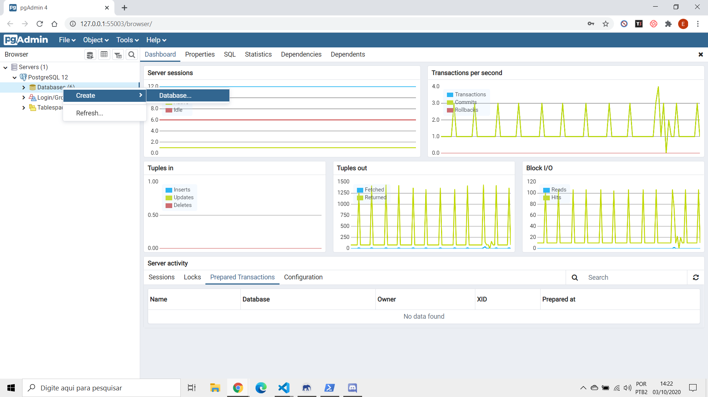
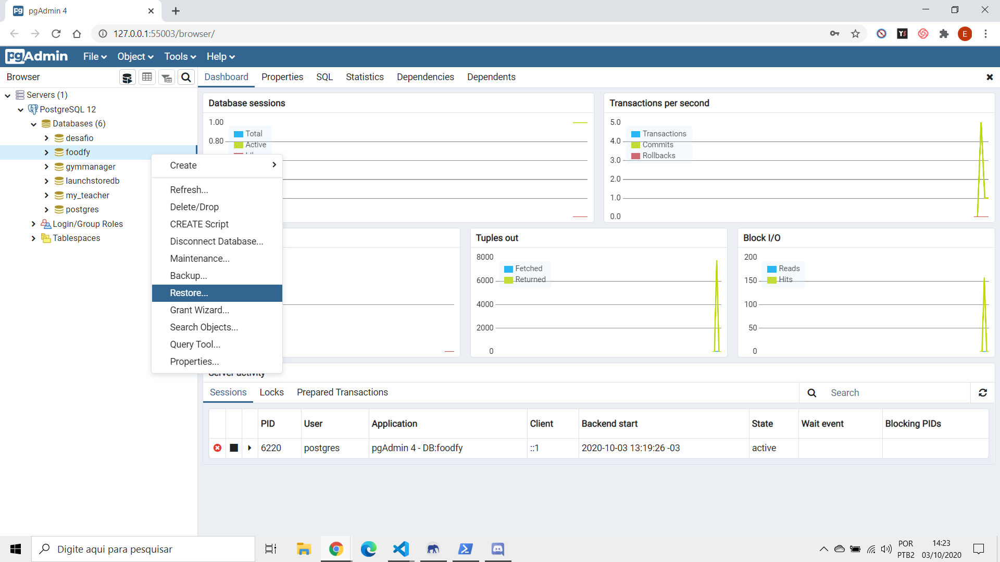
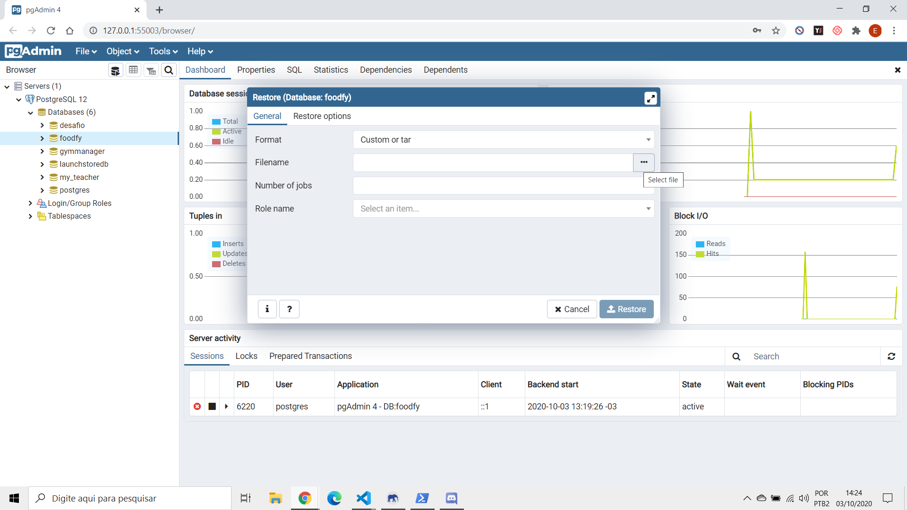
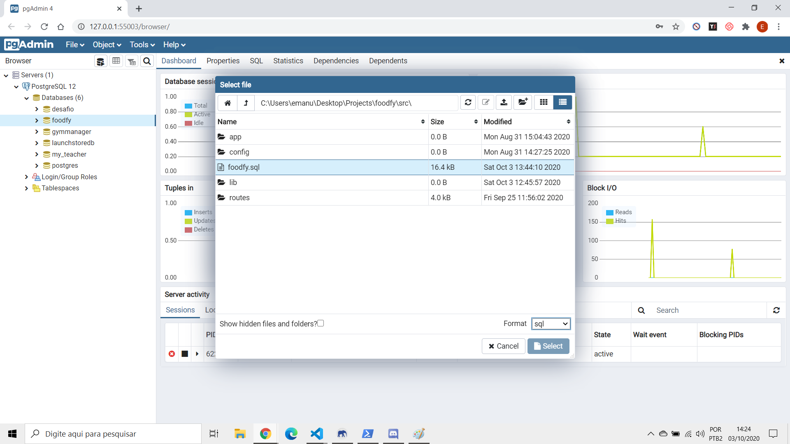
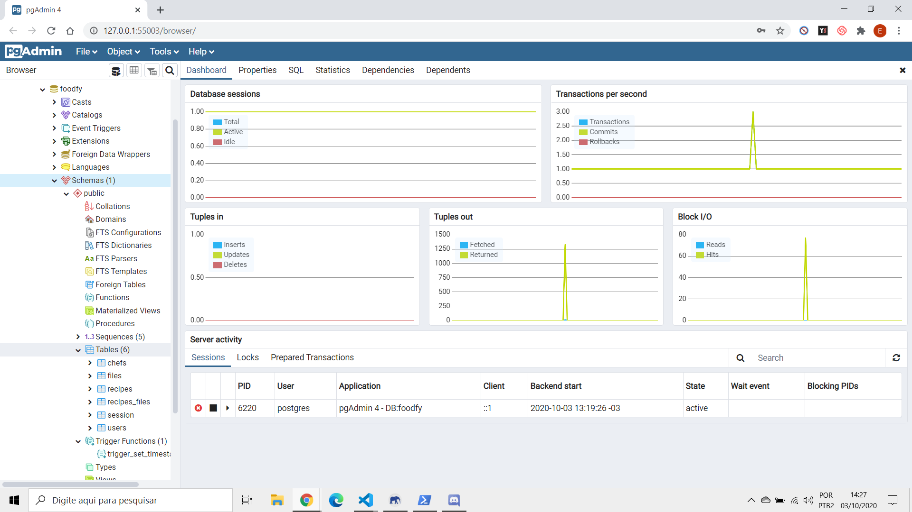

<h1 align="center">
    Imagens referentes ao passo a passo para configurar o banco de dados pelo pgAdmin
</h1>

<h3 align="center">
    Crie um banco de dados com o nome de foodfy
</h3>

<h1 align="center">
    
</h1>

<h3 align="center">
    Clique na opção restore do banco criado
</h3>

<h1 align="center">
    
</h1>

<h3 align="center">
    Procure o arquivo foodfy.sql que está dentro do repositório
</h3>

<h1 align="center">
    
</h1>

<h3 align="center">
    Selecione o arquivo foodfy.sql e execute a restauração (coloque o format para sql para que o arquivo possa ser encontrado)
</h3>

<h1 align="center">
    
</h1>

<h3 align="center">
    Para checar se o banco foi restaurado com sucesso, verifique se as tabelas foram criadas
</h3>

<h1 align="center">
    
</h1>
